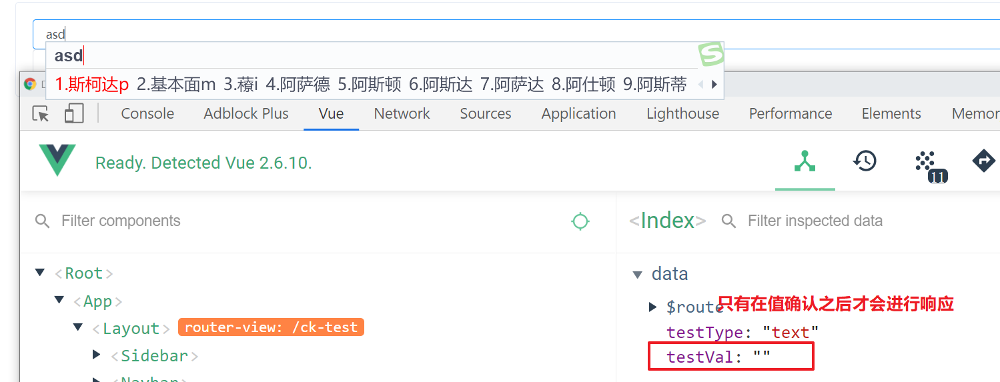

# 输入框

## 支持的类型

- text
- input
- number
- password
- email
- textarea

## Input Attributes


|       **参数**       | **说明** | **类型**                                                     | **默认值** |
| :------------------: | :------: | ------------------------------------------------------------ | :--------: |
|   value / v-model    |  绑定值  | `[String, Number]`                                           |     ''     |
|         type         | 表单类型 | `["input", "text", "number", "password", "email", "textarea"]` |   `text`   |
| 支持el-input所有参数 |          |                                                              |            |

支持修饰符，最常见的就是当我们使用number类型输入框但输入框最后给定的值是字符串，这个时候可以通过添加`.number`修饰符内部帮你自动转换为number类型

```html
<dynamic-input
  v-model="testVal"
  type="number"
 />
<!-- testVal => 'string' -->

<dynamic-input
  v-model.number="testVal"
  type="number"
 />
<!-- testVal => 'number' -->
```

表单支持的修饰符

- number： 通过 `parseFloat()`解析之后的字符串数值
- trim： 过滤首尾空白字符
- lazy： 将事件触发从input从而转为在「 类似change」在值确认之后响应(当输入法没有按下时不做值变动可以使用这个)



## Input Events

支持`el-input`所有事件

```html
<template>
  <dynamic-input
    ref="dynamicInput"
    v-model.lazy="testVal"
    :type="testType"
    @change="inputMethod"
    @input="inputMethod"
  />
</template>
```

## Input Methods

支持`el-input`所有方法，前提得通过ref去引用`dynamic-input`组件，组件封装的`el-input`默认取名`elInput`

```vue
<template>
  <dynamic-input
    ref="dynamicInput
    value="test"
  />
</template>

<script>
export default {
  mounted() {
    // 可以获取到dynamicInput组件内封装的elInput组件
    this.$refs.dynamicInput.$refs.elInput
  }
}
</script>
```
你也可以通过定义refName去重命名内部elInput组件的ref值

```vue
<template>
  <dynamic-input
    ref="dynamicInput"
    refName="child-input'
    value="test"
  />
</template>

<script>
export default {
  mounted() {
    // 可以获取到dynamicInput组件内封装的elInput组件
    this.$refs.dynamicInput.$refs['child-input']
    const {
      dynamicInput
    } = this.$refs
    // 可以通过去调用el-input组件提供方法
    dynamicInput.$refs['child-input'].focus() 
  }
}
</script>
```

## Input Slots

支持所有`el-input`提供的内置slot

```vue
<template>
  <dynamic-input
    ref="dynamicInput"
    refName="child-input'
    value="test"
  >
    <template slot="prepend">Http://</template>
    <i slot="prefix" class="el-input__icon el-icon-search" />
    <i slot="suffix" class="el-input__icon el-icon-date" />
  </dynamic-input>
</template>
```

## Autocomplete

autocomplete 是一个可带输入建议的输入框组件。可用于远程搜索， 通过传递`is-autocomplete`来确定是否渲染`el-autocomplete`组件

> 注意⚠：这里的is-autocomplete是用来判断是否渲染el-autocomplete组件的，并不是input提供的autocomplete属性

|      **参数**       |                           **说明**                           | **类型**   | **默认值** |
| :-----------------: | :----------------------------------------------------------: | ---------- | :--------: |
|  `is-autocomplete`  |                  是否渲染成autocomplete组件                  | `Boolean`  |  `false`   |
| `fetch-suggestions` | `返回输入建议的方法，仅当你的输入建议数据 resolve 时，通过调用 callback(data:[]) 来返回它` | `Function` |    必传    |

详情请查看Element-Ui官网 https://element.eleme.cn/#/zh-CN/component/input
